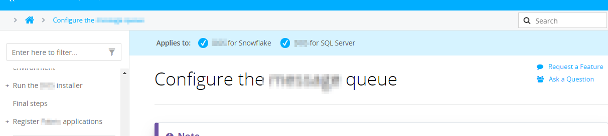
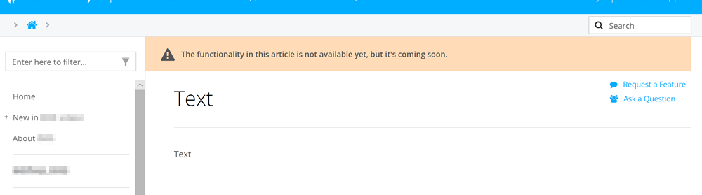
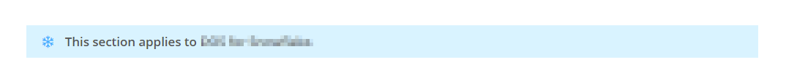

# Single-sourced content management for DocFx projects

- [Add a message bar to the top of an entire site](#add-a-message-bar-to-the-top-of-an-entire-site)
  - [Setup](#setup)
    - [Specify the text](#specify-the-text)
    - [Add a new partial](#add-a-new-partial)
  - [Modify the TOC partial](#modify-the-toc-partial)
    - [Update the CSS](#update-the-css)
    - [Update the master template](#update-the-master-template)
- [Add a conditional message bar to the top of selected pages](#add-a-conditional-message-bar-to-the-top-of-selected-pages)
  - [Setup](#setup-1)
    - [Add new partials](#add-new-partials)
    - [Update the master template](#update-the-master-template-1)
    - [Update the CSS](#update-the-css-1)
- [Add a status bar to the top of selected pages](#add-a-status-bar-to-the-top-of-selected-pages)
  - [Setup](#setup-2)
    - [Add a new partial](#add-a-new-partial-1)
    - [Update the master template](#update-the-master-template-2)
    - [Update the CSS](#update-the-css-2)
- [Add a bar with tags to the top of selected pages](#add-a-bar-with-tags-to-the-top-of-selected-pages)
  - [Setup](#setup-3)
    - [Add a new partial](#add-a-new-partial-2)
    - [Update the master template](#update-the-master-template-3)
    - [Update the CSS](#update-the-css-3)
- [Add a bar above selected paragraphs](#add-a-bar-above-selected-paragraphs)
  - [Markdown file](#markdown-file)
  - [`sourcedContent/messages.json`](#sourcedcontentmessagesjson)
  - [Output](#output)
  - [Setup](#setup-4)
    - [Include JSON files with content mappings in the build configuration](#include-json-files-with-content-mappings-in-the-build-configuration)
    - [Add the JavaScript code](#add-the-javascript-code)
    - [Update the CSS](#update-the-css-4)
    - [Add the content mappings file](#add-the-content-mappings-file)
- [Single source plain-text terms](#single-source-plain-text-terms)
  - [Markdown file](#markdown-file-1)
  - [`sourcedContent/terms.json`](#sourcedcontenttermsjson)
  - [Output](#output-1)
  - [Setup](#setup-5)
    - [Include JSON files with content mappings in the build configuration](#include-json-files-with-content-mappings-in-the-build-configuration-1)
    - [Add the JavaScript code](#add-the-javascript-code-1)
    - [Add the content mappings file](#add-the-content-mappings-file-1)

## Add a message bar to the top of an entire site

this feature puts a banner on the top of all pages in a site section.

### Setup

#### Specify the text

The text in the banner is a custom attribute that points to `docfx.json`. Add `_banner` under `globalMetadata` and input your message.

```json
{
  "globalMetadata": {
    "_banner": "This page is in development. This information may not match what's in the next release."
  }
}
```

#### Add a new partial

Add `template/partials/banner.tmpl.partial` in your template.

### Modify the TOC partial

Add `template/toc.html.tmpl` at the root of your template, not in the `partials` directory. `toc.html.tmpl` is a different kind of template file than what's in the `partials` directory.

Your `toc.html.tmpl` file may not be the same as the example in this repo. See the `<div class="sidetoc" id="bannerToc">` line for an example of what to add and modify.

#### Update the CSS

Add the `Site banner` code in `template/styles/main.css` to `<your-template>/styles/main.css`.

Notes:

- `#banner` styles the banner.
- `#banner p` styles the text in the banner.
- `#bannerToc` pushes down the table of contents. `id="bannerToc"` is added two times in `toc.htmp.tmpl`.

#### Update the master template

Add references to `banner` in `<your-template>/layout/_master.tmpl`:

```html
<div id="wrapper">
  <header>
    {{^_disableBanner}}
      {{>partials/Banner}}
    {{/_disableBanner}}
  </header>
<div id="invisible-push-down"></div>
```

Without added padding, the banner overlaps the elements beneath it. `#invisible-push-down` pushes down the elements in the articles side of the page.

## Add a conditional message bar to the top of selected pages

In any article, add a YAML heading similar to the following to show conditional content in a bar at the top of an article. In this example, applicable versions are shown.



```yaml
---
uid: title.md
title: Title
version:
  versionA: true
  versionB: true
---
```

The templating system interprets `true` and `false` without requiring custom logic to recognize those values as strings. The absence of a value is also interpreted as `false`.

### Setup

#### Add new partials

Add the following partials to your template:

- `template/partials/versions.tmpl.partial`
- `template/partials/versionA.tmpl.partial`
- `template/partials/versionB.tmpl.partial`
 
Replace icon code with any Font Awesome icon.

#### Update the master template

Add a reference to the custom partial in `<your-template>/layout/_master.tmpl`:

```handlebars
{{#if versions}}
  {{>partials/versions}}
{{/if}}
```

The `if` prevents the bar from showing on all pages. It shows only on pages with `version` in the YAML header.

#### Update the CSS

Add the `Conditional message bar` code in `template/styles/main.css` to `<your-template>/styles/main.css`.


## Add a status bar to the top of selected pages

These steps add a customizable message at the top of a selected page in a yellow block. In this example, the message says functionality documented on the page is not released yet.



In any article, add a `statusMessage` to the YAML heading:

```yaml
---
uid: title.md
title: Title
statusMessage: The functionality in this article is not available yet, but it's coming soon.
---
```

### Setup

#### Add a new partial

Add `template/partials/statusMessage.tmpl.partial` in your template. Replace the icon code with any Font Awesome icon.

#### Update the master template

Add a reference to the custom partial in `<your-template>/layout/_master.tmpl`. Add the following after `{{/_disableToc}}`:

```handlebars
{{#if statusMessage}}
  {{^_disableStatusMessage}}
    {{>partials/statusMessage}}
  {{/_disableStatusMessage}}
{{/if}}
```

The `if` prevents the message from showing on all pages. It only shows on pages with `statusMessage` in the YAML header.

#### Update the CSS

Add the `Status bar` code in `template/styles/main.css` to `<your-template>/styles/main.css`.

## Add a bar with tags to the top of selected pages

In any article, add a `tag` to the YAML heading:

```yaml
---
uid: title.md
title: Title
tag: abc,def,ghi
---
```

### Setup

#### Add a new partial

Add `template/partials/tags.tmpl.partial` in your template.

#### Update the master template

Add a reference to the custom partial in `<your-template>/layout/_master.tmpl`:

```handlebars
{{#if tag}}
  {{^_disableTag}}
    {{>partials/tag}}
  {{/_disableTag}}
{{/if}}
```

The `if` prevents the tag from showing on all pages. It shows only on pages with `tag` in the YAML header.

#### Update the CSS

Add the `Tags` code in `template/styles/main.css` to `<your-template>/styles/main.css`.

In the built site, the styled tag shows at the top of the article.

## Add a bar above selected paragraphs



Placeholder text in Markdown files, such as `{{ message }}`, adds a style-able heading bar anywhere in an article when the site is built. The text draws on a JSON file with single-sourced content mappings.

Example use case: Steps in a guide sometimes apply only to product version 1. Instead of identifying these steps in the text manually, add a placeholder marker in those locations. A message in a single-source file populates a message bar above those steps.

### Markdown file

```markdown
Install steps

{{ version-1.2.3 }}

Step 1...
```

### `sourcedContent/messages.json`

```json
{
  "version-1.2.3": {
    "message": "This section applies only to version 1.2.3.",
    "icon": "fa-cloud"
  }
}
```

Replace the `icon` code with any Font Awesome icon.

### Output

```plaintext
Install steps

<icon> This section applies only to version 1.2.3.

Step 1...
```

Order of the icon and text are determined in the JavaScript file for messages below.

### Setup

#### Include JSON files with content mappings in the build configuration

Add this line in the `resource` > `files` section of `docfx.json`:

```json
"sourcedContent/*.json"
```

#### Add the JavaScript code

Add `main.js` in your `<your-template>/styles` directory.

Paste in the `Add a bar above selected paragraphs` code in this repo's `main.js` .

#### Update the CSS

Add the `Paragraph bar` code in `template/styles/main.css` to `<your-template>/styles/main.css`.

#### Add the content mappings file

Add and customize `sourcedContent/messages.json`:

```json
{
  "anyTerm": {
    "message": "Any paragraph heading message",
    "icon": "fa-cloud"
  },
  "anotherTerm": {
    "message": "Another paragraph heading message",
    "icon": "fa-database"
  }
}
```

## Single source plain-text terms

Content mappings for terms in `sourcedContent/terms.json` render plain-text, single-sourced replacements. No formatting is applied.

Example use case: A product name changes from `Product A` to `Product AB`. Instead of searching and replacing every instance of `Product A`, replace the product name once in the single-sourced file.

### Markdown file

```plaintext
This is a document for the {{ product }} Suite.
```

### `sourcedContent/terms.json`

```json
{
  "product": "Product A"
}
```

### Output

```plaintext
This is a document for the Product A Suite.
```

### Setup

#### Include JSON files with content mappings in the build configuration

Add this line in the `resource` > `files` section of `docfx.json`:

```json
"sourcedContent/*.json"
```

#### Add the JavaScript code

Add `main.js` in the `template/<your-template>/styles` directory.

Paste in the `Single source plain-text terms` code in this repo's `main.js` .

#### Add the content mappings file

Add and customize `sourcedContent/terms.json`:

```json
{
  "example term 1": "Example Term 1",
  "example term 2": "Example Term 2"
}
```
